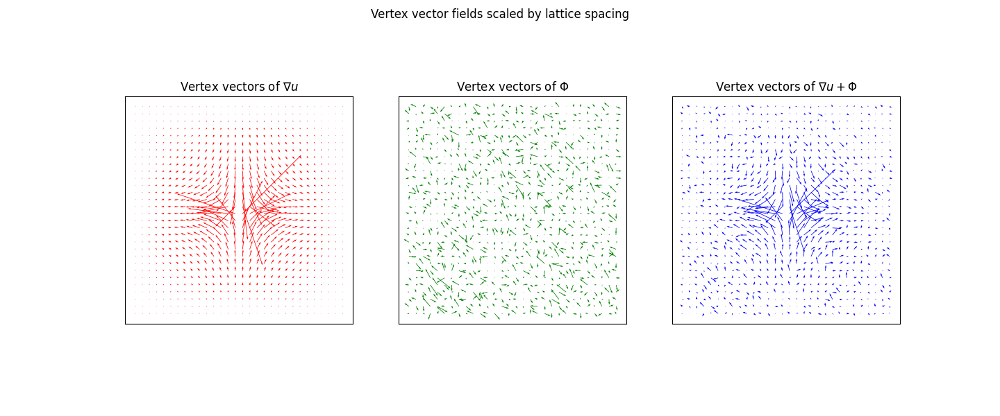
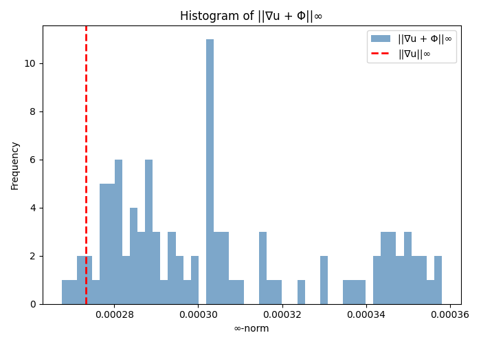

# Minimal-∞ Solution of `div Φ = f` on a 2D Torus

This project explores **bounded vector fields** on a 2D periodic grid that solve
\[
\operatorname{div}\,\Phi = f
\]
while (approximately) **minimizing the \(L^\infty\) norm** of \(\Phi\).
We start from the **gradient solution** and then use **simulated annealing** to
add small **divergence-free currents** that reduce \(\|\Phi\|_\infty\) without changing the divergence.

- Code: `poisson_mc.c` (Poisson + annealing)
- Domain: 2D grid, **nearest-neighbour**, **periodic boundary conditions** (torus)
- Goal: minimize \(\|\Phi\|_\infty\) under the constraint \(\operatorname{div}\Phi=f\)

---

## Motivation (why we care)

We are interested in the stability of **irreversible dynamics** of the form
\[
\partial_t \mu_t = \operatorname{div}\big(S_{\mu_t} + R_{\mu_t}\big),
\]
where at equilibrium \(\mu=m\), the *remainder/current* \(R_m\) is **divergence-free**.  
Using \(\Phi\) as a discrete flux, a **small sup-norm** \(\|\Phi\|_\infty\) corresponds to avoiding localized “hot spots” of transport and contributes to **robustness/stability**. Our numerical approach constructs such fluxes explicitly and quantifies how much improvement over the naive gradient flux is achievable.

---

## Mathematical & Discrete Setup

- **Grid:** \(\mathbb{Z}_N \times \mathbb{Z}_N\) (periodic).  
- **Edges & antisymmetry:** A vector field \(\Phi\) is an **edge function**
  \(\Phi(i\to j) = -\Phi(j\to i)\) on nearest-neighbour edges.
- **Discrete divergence:** at a vertex \(x\),
  \[
  (\operatorname{div}\Phi)(x) = \sum_{y\sim x} \Phi(x\to y).
  \]
- **Discrete gradient:** for a scalar potential \(p\),
  \[
  (\nabla p)(x\to y) = p(y) - p(x).
  \]
- **Poisson:** the gradient solution \(\Phi_0 = \nabla p\) solves \(\operatorname{div}\Phi_0=f\) when
  \(p\) solves \(\Delta p = f\) (with zero mean on the torus).
  Among **gradients**, \(\Phi_0\) minimizes the \(\ell^2\) norm.

> We are **not** minimizing \(\ell^2\); we want (approximately) minimal \(\ell^\infty\) among **all** solutions \(\Phi=\Phi_0+\psi\) with \(\operatorname{div}\psi=0\).

---

## Method in a Nutshell

1. **Initialize (Poisson solve):**  
   Solve \(\Delta p = f\) (mean-zero) on the torus, set \(\Phi \leftarrow \nabla p\).  
   (FFT-based Poisson for periodic BCs; other solvers possible.)

2. **Divergence-free proposals:**  
   Propose local updates \(\Phi \leftarrow \Phi + \alpha D\), where \(D\) is **divergence-free**.  
   On a grid, a simple \(D\) is a **circulation around a plaquette** (closed loop).

   > Illustration idea:
   > 
   > *A closed cycle on the graph induces a div-free update; general div-free fields decompose into sums of such cycles.*

3. **Objective:**  
   Minimize \(\|\Phi\|_\infty = \max_{e\in E} |\Phi(e)|\).

4. **Simulated annealing:**  
   Accept any move that decreases \(\|\Phi\|_\infty\); otherwise accept with probability \(\exp(-\Delta/\tau)\). Lower \(\tau\) over time (cooling schedule).

5. **Stop:**  
   When the temperature is low and no improvements occur for several sweeps (or max iterations reached).

---

## What We Report / Plot 

We track and visualize:

- \(\| u \|_\infty\): gradient (Poisson) solution
- \(\|\Phi_{\text{annealed}}\|_\infty\): the infinity norm every each step
-  We use the scripts to provide some pots. The most interesting ones are the histograms of the $L^infty$ norms and the plot of $\Phi$ and $\nabla u$ 

Example figures:

- Final \(\Phi\):  
  
- Sup-norm found during annealing:  
  
  (There is an abuse of notation and we have used Phi also to denote the difference between $\nabla u$ and $\Phi$)
---

## Building & Running

### Dependencies
- C compiler
- (Recommended) **FFTW3** if you use the periodic FFT Poisson solve

**Example compile with FFTW:**
```bash
gcc -O3 -march=native -ffast-math -Wall poisson_mc.c -o poisson_mc -lfftw3 -lm
```

If you don’t have FFTW installed, you can either install it or switch to a non-FFT Poisson solver (CG/SOR) if available in the code.

### Typical usage
```bash
# Defaults (synthetic f)
./poisson_mc

# Example with options (adapt to the flags in your code)
./poisson_mc \
  --nx 256 --ny 256 \
  --input data/f.dat \
  --bc periodic \
  --anneal initial=0.5,final=1e-4,decay=0.995 \
  --sweeps 200 \
  --seed 12345 \
  --out-prefix results/run1
```

> **Note:** replace the flags above with the *exact* ones supported by your `poisson_mc.c` (add `--help` output here if available).

### Outputs
- `*_phi_grad.bin` — initial gradient field \(\Phi_0\) (optional)
- `*_phi.bin` — final field \(\Phi\) (interleaved components or one file per component)
- `*_div.bin` — divergence check (should match \(f\) up to discretization)
- `*_log.txt` — temperature, acceptance, and \(\|\Phi\|_\infty\) trace
- Figures under `images/` or `results/` (if enabled)

---

## Numerical Remarks

- **Solvability on the torus:** require \(\sum_x f(x)=0\) (mean-zero). Center \(f\) if needed.
- **Divergence-free updates:** cycles around plaquettes are convenient; in practice, randomize size/location and step \(\alpha\) to shave peaks in the sup-norm.
- **Cooling:** start \(\tau_0\) comparable to typical edge magnitudes; decay \(\gamma\approx 0.995{-}0.999\).
- **Verification:** recompute \(\operatorname{div}\Phi\) at the end and compare to \(f\) (L² error ~ discretization noise).

---

## References (theoretical backdrop)

- **Bourgain & Brezis (2003):** *On the equation div Y=f and application to control of phases*, J. Amer. Math. Soc. 16(2):393–426, 2003.  
- **Albert Cohen, Ronald Devore & Eitan Tadmore (2024)** *Construction of bounded solutions of div u=f in critical spaces*.  

These works guarantee bounded solutions under appropriate assumptions and motivate searching for constructions with controlled \(L^\infty\) size. Our discrete method provides an explicit, computational counterpart and a way to *measure* the achievable sup-norm.

---

## Roadmap / To-Dos

- [ ] Perform the Scaling limit and compare the $L^\infty$ norm with the one build in the 2024 article  
- [ ] Find an example of f where div(Phi) = f is such that Phi convergence, Lambda u = f is such that u does not converge, and f does not converge


---

## License

Choose a license (e.g., MIT/BSD-3-Clause) and add a `LICENSE` file.
